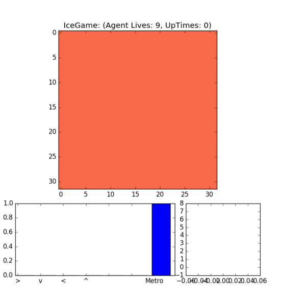

# Emergence of Loop Algorithm from exploration of Ice Configuration
The final project of ADLxMLDS 2017 Fall in NTU.

## Introduction

Our work makes machine understand physics using reinforcement learning. The agent can 

The trained agnet works as long loop algorithm with loop size 4x4 to 2x4. The acceptance ratio achieves 65~70%.



## Prerequisites
General
* CMake (>= 2.8.3)
* Boost (>= 1.3.2)
* Python 2.7
* C++ compiler

Python
* matlotlib
* Tesnorflow 1.2

For Mac OSX, we need to install extra boost-python library.
```
brew install cmake boost-python
```
for more https://github.com/TNG/boost-python-examples

## Installation
1. Compile libicegame
2. Install IcegameEnv

### Icegame Source Codes
Compile the `libicegame`
```
cd icegame
sh compile.sh
```

### Gym-icegame
Then, install our Gym for `IceGameEnv-v0`
```
cd gym-icegame
python2.7 setup.py install
```

## Inference
The inference should be executed at the folder rlloop. Go to the folder and download the trained model.
```
cd rlloop
sh download.sh
```

Now, play it
```
python2.7 play_icegame.py --log-dir saved_model
```

## Training

The following command will launch 8 workers 1 parameter server and 1 rewards monitor.
```
python train_with_monitor.py -w 8 -l logs/my_task
```

## Experiment Settings